# Hoe-gebruik-je-apps-in-Teams

Hier word uitgelegd hoe je apps kan installeren in Teams kanalen.

  

## Inleiding 

### Wat kunnen deze apps en waarom zou je ze gebruiken?

          

## Inhoudsopgave

[Hoofdstuk 1 basis: Teams installeren](#hoofdstuk-1-basis-teams-installeren)

 

[Hoofdstuk 2 basis: Teams configure](#hoofdstuk-2-basis-teams-configure)

 

[Hoofdstuk 3 basis: Project app installeren](#hoofdstuk-3-basis-project-app-installeren)

 

[Hoofdstuk 4 basis: Roadmap app installeren](#hoofdstuk-4-basis-roadmap-app-installeren)

 

[Hoofdstuk 5 basis: Leren werken met de project applicatie](#hoofdstuk-5-basis-leren-werken-met-de-project-applicatie)
- [Hoofdstuk 5.1 basis: Het "Rooster" / "Grid" leren](#hoofdstuk-51-basis-het-rooster--grid-leren)
- [Hoofdstuk 5.2 basis: Het "Board" leren](#hoofdstuk-52-basis-het-board-leren)
- [Hoofdstuk 5.3 basis: De "Grafieken" / "Charts" leren](#hoofdstuk-53-basis-de-grafieken--charts-leren)

 

[Hoofdstuk 6 basis: Leren werken met de Roadmap applicatie](#hoofdstuk-6-basis-leren-werken-met-de-roadmap-applicatie)

          

## Hoofdstuk 1 basis: Teams installeren:

  

Volg de link en click op "Download de app voor desktop" / "Download app for desktop" links op je scherm.

De link: https://www.microsoft.com/en-us/microsoft-teams/download-app?ocid=ORSEARCH_Bing&lc=1033

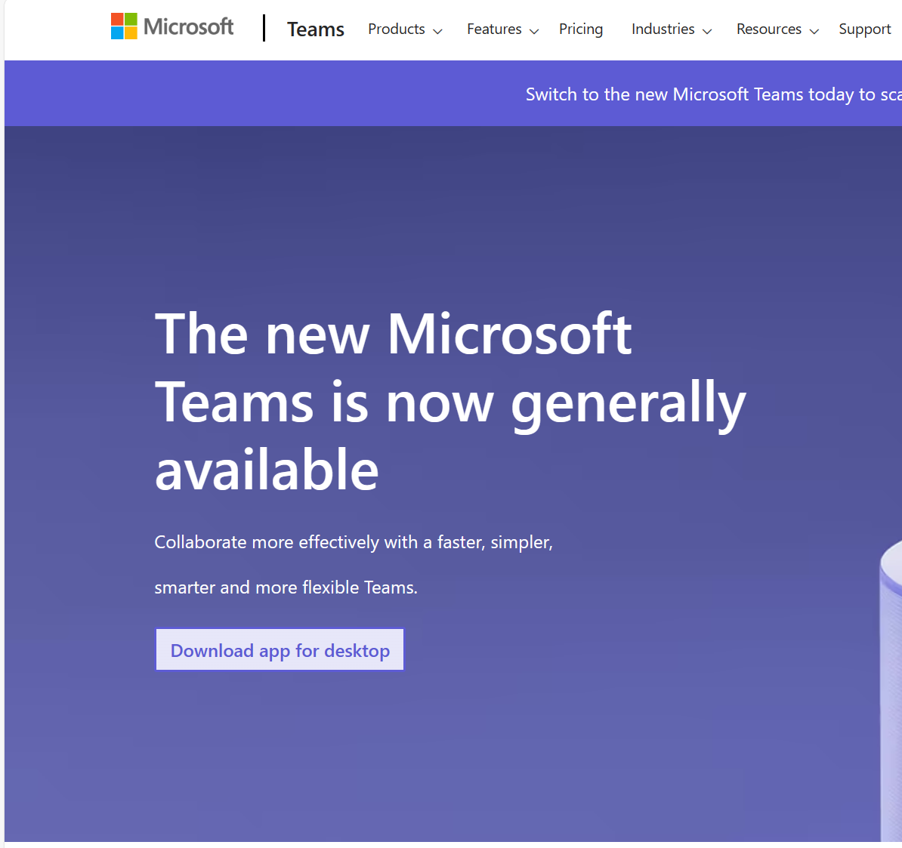

    

          

## Hoofdstuk 2 basis: Teams configure:

  

Als Teams gesloten is open de app via jouw desktop snelkoppeling of anders type "Microsoft Teams" in je zoekbalk links onderaan en dubbel klik de bovenste keuze:

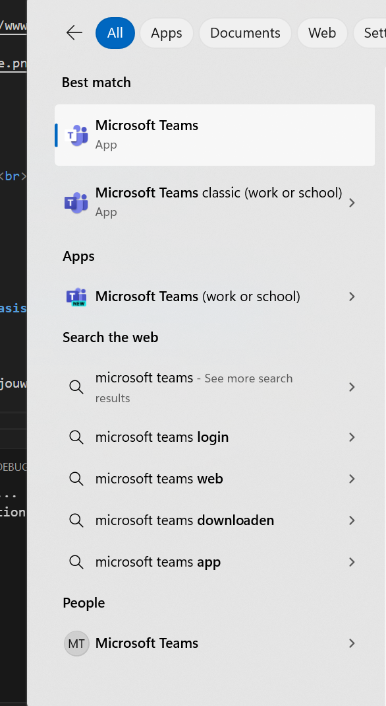

    

Maak zeker dat je juist ingelogd bent rechtsboven in de app:

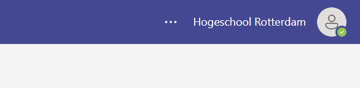

    

En dat je toegang hebt tot de juiste kanalen links boven:

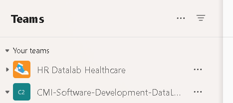

          

## Hoofdstuk 3 basis: Project app installeren:

  

Als de Project app al geïnstalleerd is op de juiste kanaal kan je de app zien bij "Generaal" / "General" en dan rechts boven.

Als er te veel opties/apps boven aan staan krijg je een plus icoon rechts boven, klik hier op om alle overige opties/apps te zien in dit geval zie je de "Roadmap"

Als jij de apps "project Algemeen" en "Roadmap algemeen" niet ziet staan volg dan de rest van stap drie, anders skip naar de stap vijf.

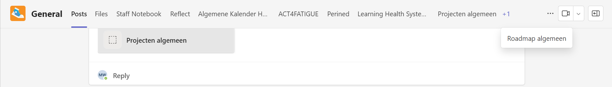

    

Als dat gedaan is ga naar het juiste kanaal toe en druk op de drie puntjes icoon rechts van het kanaal, en selecteer "generaal" / "general"

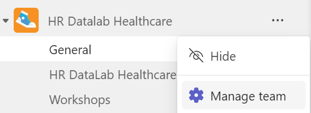

    

In de nieuwe tab sta je automatisch op "Deelnemers" / "Members" selecteer rechts boven aan "Apps"

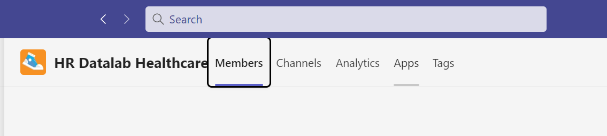

    

In de nieuwe tab klik op "Meer apps downloaden" / "Get more apps" links bovenaan:

    

In de nieuwe tab scroll naar beneden en klik op "Voeg toe" / "Add" bij project:

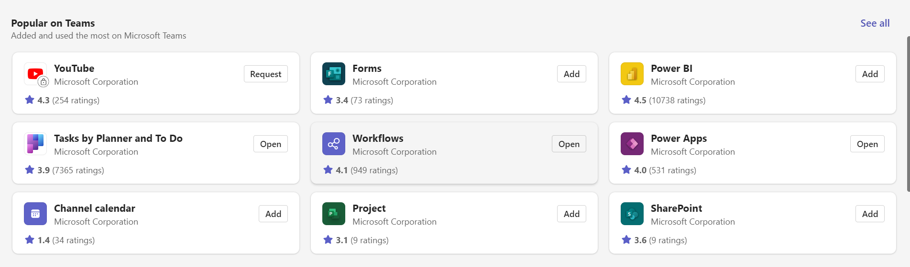

    

Klik nu op "Toevoegen aan een team" / "Add to a team" en type de naam van je gekozen kanaal in dit geval "HR Datalab Healthcare" 

Als hij er niet bijstaat dan is het al geïnstalleerd op dit kanaal, of jij hebt geen toegang om deze verandering aan te maken op dat kanaal:

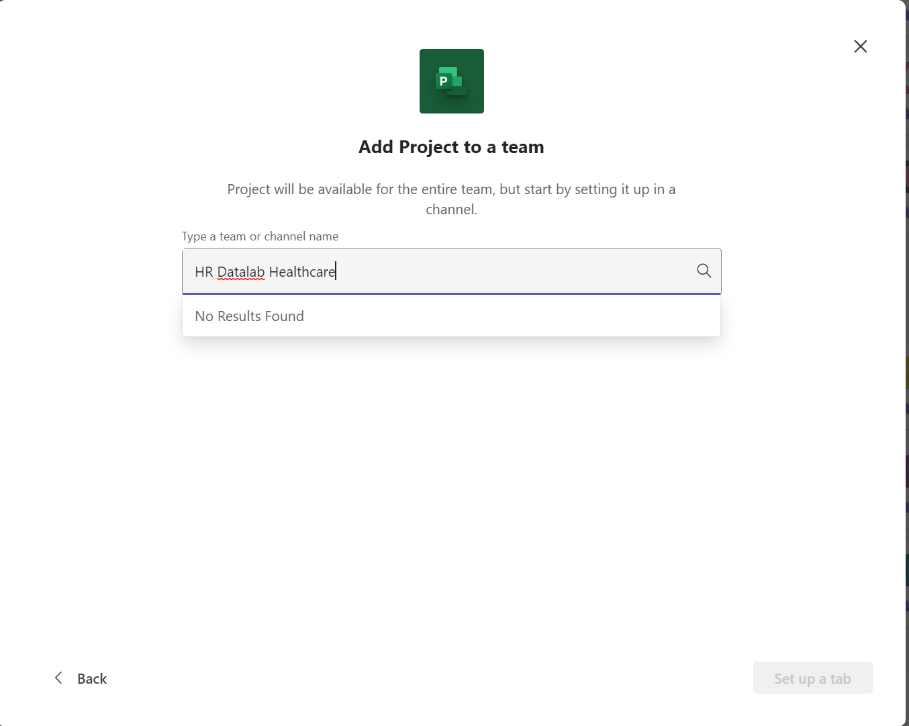

          

## Hoofdstuk 4 basis: Roadmap app installeren:
Ga naar het juiste kanaal toe en druk op de drie puntjes icoon rechts van het kanaal, en selecteer "generaal" / "general"

    

In de nieuwe tab sta je automatisch op "Deelnemers" / "Members" selecteer rechts boven aan "Apps"

    

In de nieuwe tab klik op "Meer apps downloaden" / "Get more apps" links bovenaan:

    

Scroll nu naar beneden tot "Gebouwd door Microsoft" / "Build by Microsoft" en klik op "zie alles" / "see all"

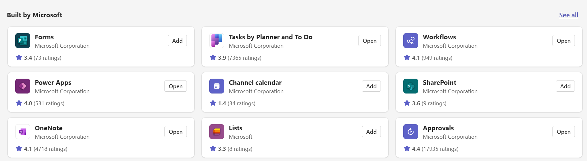

    

En zoals bij de vorige app doe het zelfde voor de Roadmap app:

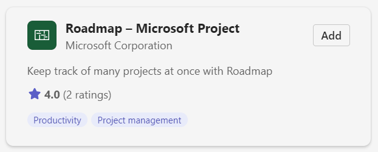

    

Om nu terug te gaan naar "generaal" / "general" kan je links boven aan op de pijl naar links klikken en vervolgens linksboven op "generaal" / "general"

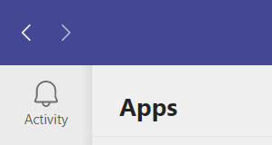

          

## Hoofdstuk 5 basis: Leren werken met de project applicatie:

  

Je kan deze video bekijken op YouTube over de "Projecten app" / "Project app", maar de video is wel Engels: https://www.youtube.com/watch?v=evIBUXqeRhQ 

  

Ik ga nu zelf ook nog uitleggen over de functies en navigatie.

  

Als je de "Projecten app" / "Project app" tab opent in 'generaal" / "general" kan je drie opties bovenaan zien: 

"Rooster" / "Grid",

"Board", 
 
"Grafieken" / "Charts" 

Hiervan is "Rooster" / "Grid" al open.

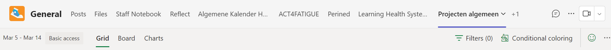

    

### Hoofdstuk 5.1 basis: Het "Rooster" / "Grid" leren:

  

Het doel van de "Rooster" / "Grid" is om de status van projecten overzichtelijk te maken en makkelijk te kunnen veranderen.

  

Links boven aan zie je dat projecten in het "Rooster" / "Grid"

Je navigeert deze grid door op juiste kolom te zitten van de juiste project verticaal en de juiste categorie die je wilt aanpassen horizontaal.

Je ziet hier dat de projecten namen hebben,

Dat de projecten verticaal Genummerd zijn van laag naar hoog,

En dat je met klikken ze bij de circle kan afvinken als ze klaar zijn:

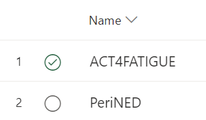

    

Bovenaan in het midden zie je dat je "Korte kijk" "Short look" en "Toegewezen" / "assigned"

Bij "Korte kijk" / "Short look" kan je zien of er bestanden zijn toegevoegd aan het project.

Je kan bij Toegewezen" / "assigned" kijken wie welke taak gegeven is, en als je over het project zweeft met je muis zie je een persoon icoon waar je kan op klikken om mensen zelf toetenvoegen. 

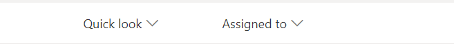

    

Rechtsboven zie je dat je:

De Duratie per project kan bepalen, 

de start datum kan bepalen, 

en de datum wanneer het klaar was kan invullen.

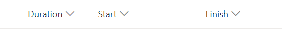

    

En links onderaan kan je projecten aan maken door op de plus icoon of de zin "Nieuwe taak toevoegen" / "Add new task" te klikken.

Veder moet je alleen de naam alvast invullen om te zorgen dat de nieuwe project blijft staan.

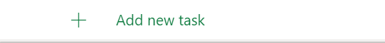

    

### Hoofdstuk 5.2 basis: Het "Board" leren:

  

Het board is meer eenvoudig je organiseert via emmers / buckets.

Deze lijken erg op Werklasten, je kan de emmers / buckets verdelen op wat handig is zoals:

Deadlines, 

samenhangende project doelen,

kleinere taken van een project,

of zelfs gebaseerd op wie de klant is.

  

Net zoals bij het "Rooster" / "Grid" kan je projecten/taken toevoegen.

Maar je kan ook emmers / buckets toevoegen om meer te kunnen sorteren dus de emmers/buckets.

Bij beide moet je een naam toevoegen om projecten/taken/emmers te kunnen aanmaken.

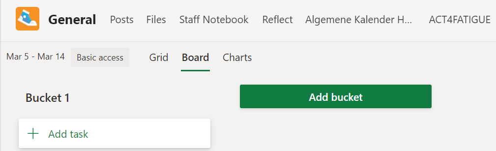

    

### Hoofdstuk 5.3 basis: De "Grafieken" / "Charts" leren:

  

"Grafieken" / "Charts" zijn ook redelijk simpel.

Gebaseerd op de progressie van Het "Rooster" / "Grid" kan je hier de visuals zien van hoeveel werk af is en door wie het meeste af is.

Dit onderdeel heeft geen input dus je kan er alleen naar kijken voor feedback.

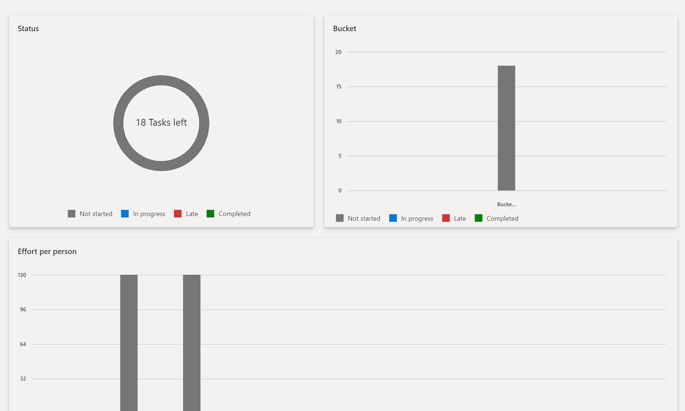

          

## Hoofdstuk 6 basis: Leren werken met de Roadmap applicatie:

  

Je kan deze video bekijken op YouTube over de  "Stappenplan app" / "roadmap app" , maar de video is wel Engels: https://youtu.be/kC1oZj0nOsc?si=Hf6vcI4wTj4osW1L 

  

Ik ga nu zelf ook nog uitleggen over de functies en navigatie.

  

De "Roadmap app" werkt als een soort kalender voor de tijds duur van projecten.

De horizontale zijde weergeeft de tijds duur in dagen van links naar rechts.

De verticale kant weergeeft het aantal projecten.

De verticale en horizontale kanten samen weergeven een duidelijk beeld van welke projecten wanneer bezig zijn en welke projecten overlappen in tijd.

Ik kan er nu persoonlijk niet in werken omdat ik geen toegang heb, maar je kan zien dat je links boven "Rijen" / "rows" en "Belangrijke datum toevoegen" / "add key date" kan toevoegen.

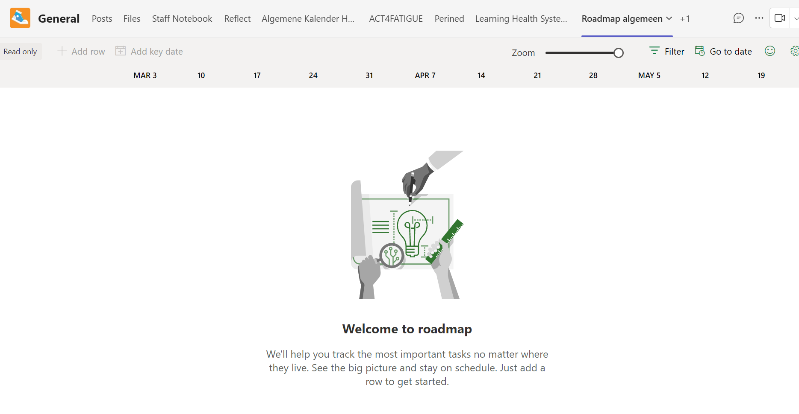

    

Hier is een voorbeeld van hoe een Roadmap er uit kan zien als hij af is: 

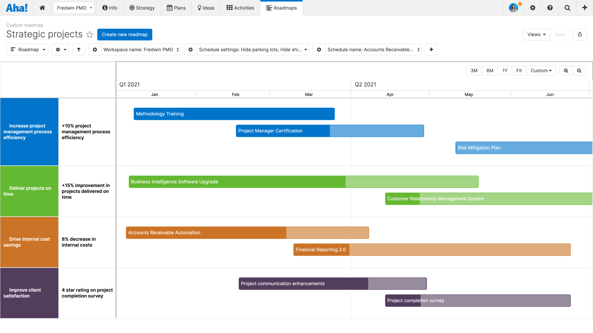