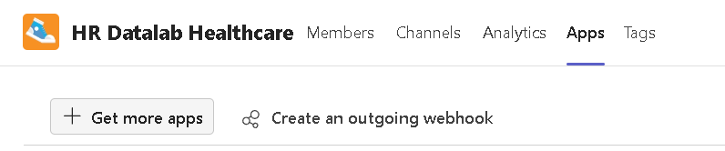

# Hoe-gebruik-je-team-apps

Hier word uitgelegd hoe je apps kan installeren in Teams kanalen.

  

## Inleiding 

### Wat kunnen deze apps en waarom zou je ze gebruiken?

          

## Inhoudsopgave

Hoofdstuk 1 basis: Teams installeren:

Hoofdstuk 2 basis: Apps van toepassing installeren:

Hoofdstuk 3 basis: App kennis leren:

          

## Hoofdstuk 1 basis: Teams installeren:

  

Volg de link en click op "Download de app voor desktop" / "Download app for desktop" links op je scherm.

De link: https://www.microsoft.com/en-us/microsoft-teams/download-app?ocid=ORSEARCH_Bing&lc=1033

    

          

## Hoofdstuk 2 basis: Apps van toepassing installeren

  

Als gesloten open de app via jouw desktop snelkoppeling of anders type "Microsoft Teams" in je zoekbalk links onderaan en dubbel klik de bovenste keuze:

    

Maak zeker dat je juist ingelogd bent rechtsboven in de app:

    

Als het al geïnstalleerd is op de juiste kanaal kan je de apps zien bij "Generaal" / "General" en dan rechts boven.

Als er te veel opties/apps boven aan staan krijg je een plus icoon rechts boven, klik hier op om alle overige opties/apps te zien in dit geval zie je de "Roadmap"

Als jij de apps "project Algemeen" en "Roadmap algemeen" niet ziet staan volg dan de rest van stap twee, anders skip naar de stap drie.

    

Als dat gedaan is ga naar het juiste kanaal toe en druk op de drie puntjes icoon rechts van het kanaal, en selecteer "generaal" / "general"

    

In de nieuwe tab sta je automatisch op "Deelnemers" / "Members" selecteer rechts boven aan "Apps"

    

In de nieuwe tab klik op "Meer apps downloaden" / "Get more apps" links bovenaan:

    

In de nieuwe tab scroll naar beneden en klik op "Voeg toe" / "Add" bij project:

    

Klik nu op "Toevoegen aan een team" / "Add to a team" en type de naam van je gekozen kanaal in dit geval "HR Datalab Healthcare" 

Als hij er niet bijstaat dan is het al geïnstalleerd op dit kanaal, of jij hebt geen toegang om deze verandering aan te maken op dat kanaal:

    

Terug bij "Meer apps downloaden" / "Get more apps" scrollen we nu naar beneden tot "Gebouwd door Microsoft" / "Build by Microsoft" en klik op "zie alles" / "see all"

    

En zoals bij de vorige app doe het zelfde voor de Roadmap app:

    

Om nu terug te gaan naar "generaal" / "general" kan je links boven aan op de pijl naar links klikken en vervolgens linksboven op "generaal" / "general"

          

## Hoofdstuk 3 basis: App kennis leren

  

Je kan deze video bekijken op YouTube over de "Projecten app" / "Project app", maar de video is wel Engels: https://www.youtube.com/watch?v=evIBUXqeRhQ 

  

Voor degenen die geen Engels kunnen zal ik de belangrijkste punten uitleggen.

  

Als je de "Projecten app" / "Project app" tab opent in 'generaal" / "general" kan je drie opties bovenaan zien: 

"Rooster" / "Grid",

"Board", 
 
"Grafieken" / "Charts" 

Hiervan is "Rooster" / "Grid" al open.

